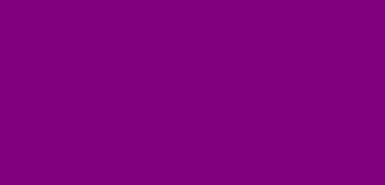

## 개요

styled-components는 **리액트 컴포넌트 시스템에서 스타일링을 어떻게 하면 효과적으로 할 수 있을까**에 대한 고민에서 시작되었다.

styled-components를 사용하면 다음과 같은 이점을 얻을 수 있다.

- critical CSS

  - 빠른 렌더링을 위한 critical CSS 라는 기술이 있는데, styled-components는 페이지에 렌더링 해야 할 요소들의 스타일만 load할 수 있게 한다.

- class name 자동 생성

  - HTML 클래스 이름 명명법은 매우 중요히 제시되어 왔다. (ex) BEM 표기법) styled components는 자동적으로 요소들 마다 각자의 다른 클래스 이름을 만들어준다. 따라서 이로 인한 human error를 사전에 방지해준다.

- CSS 삭제를 쉽게 만들어 준다.

  - 가끔 잘못 작성되거나 아예 사용하지 않는 CSS 코드를 찾으려고 자신의 프로젝트 방방곡곡을 헤메는 경우가 다들 있을 것이다. styled components는 컴포넌트와 함께 묶여져 있으므로 컴포넌트가 삭제 될 경우 스타일 또한 함께 삭제된다.

- dynamic styling이 쉽다.

  - 기존의 동적 스타일링은 조건에 맞춰 DOM을 파싱하여 바꿔주는 등 여러 수고를 거쳐야 했지만 styled components는 props를 이용하여 동적 스타일링을 보다 직관적으로 코드 작성을 할 수 있게 한다.

- 자동 vendor prefixing
  - CSS3가 발달함에 따라 여러 기술들이 추가되고 있지만 브라우저는 이에 맞게 업데이트를 하지 않는 경우가 많다. 이를 위해 vendor prefix(-webkit-, -moz-, ...)를 사용해야 하는데, styled components는 이를 자동으로 추가시켜준다.

## 오 좋은것 같아요 그럼 어떻게 사용하나요??

놀랍게도, styled-components는 따로 CSS를 만들어 매핑할 필요가 없다!!  
단순히 component를 생성하듯 만들면 된다.
다음 코드는 div에 style을 붙여 만든 컴포넌트이다.

```js
const MyBox = styled.div`
  height: 200px;
  width: 400px;
  background-color: purple;
  display: flex;
  justify-content: center;
  align-items: center;
`;
```



위 코드처럼 styled에 html 태그를 붙여서 만들면 된다.

## 동적 스타일링도 하고 싶어요!!

props를 활용하면 아주 쉽게 개발할 수 있습니다!!

```js
const MyTitle = styled.h1`
  font-size: 20px;
  color: ${(props) => (props.getout ? "red" : "blue")};
`;
...
<MyTitle>코로나</MyTitle>
<MyTitle getout>물러가라</MyTitle>
```


다음과 같이 props에 값을 전달하여 요소들을 동적으로 관리할 수 있습니다.

## 기존 스타일 확장하기

동적으로 props를 사용해 관리할 수 있겠지만, 어느 정도의 한계를 느끼고 확장이 필요한 경우가 있다.
이런 경우, styled() 생성자를 이용할 수 있다.

```js
const Header = styled.h1`
  background-color: black;
`;

const MyTitle = styled(Header)`
  font-size: 20px;
  color: ${(props) => (props.getout ? "red" : "blue")};
`;
```


다음과 같이 미리 정의해 둔 component에 styled()를 이용하여 확장 시킬 수 있다.

## 정리

위의 예제는 매우 기본적인 부분만 다루었다. styled components는 리액트의 컴포넌트 시스템의 스타일링을 위해 고안되었기 때문에 props를 활용하면 무궁무진하게 활용할 수 있을 것이다.

## Reference

- [styled-components official documentation](https://styled-components.com/)
